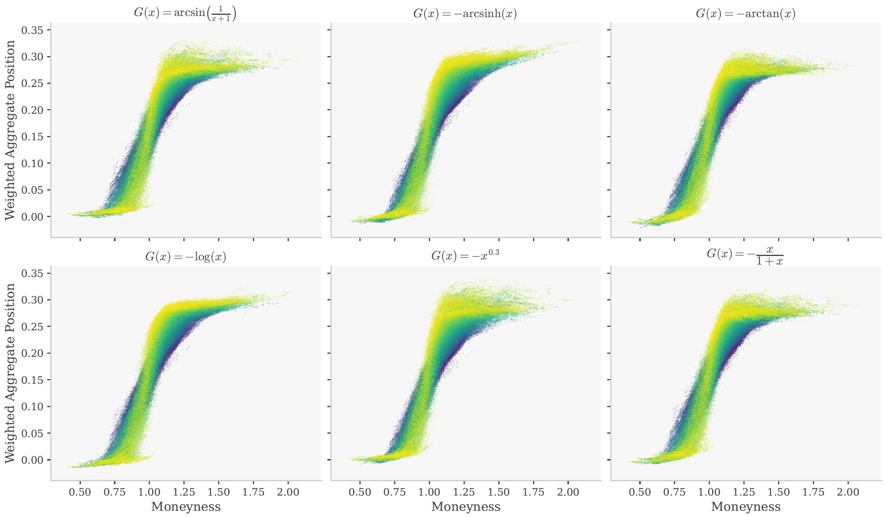

This repository contains the Python code to replicate the experiments in the upcoming paper **Actor-Critic Deep Hedging under Time-Consistent Dynamic Risk** by Shuyi Zhang  `Szhang3314@inst.hcpss.org` and Frederic Godin `frederic.godin@concordia.ca`.

---

## Overview

We study a deep hedging framework in which the agent minimizes risk through a time-consistent dynamic CVaR objective rather than a static one. The critic estimates dynamic risk using the conditional elicitability of CVaR jointly with VaR, which avoids nested simulation and substantially improves training efficiency. The actor is updated via policy gradient against the risk estimated by the critic. We apply this framework to a basket option on 4 underlying assets evolving under a DCC-GARCH model across a daily, 1-year time grid, and compare the proposed dynamic risk approach against a static CVaR baseline and a nested critics heuristic across 4 risk thresholds (92.5%, 95%, 97.5%, 99%) and 6 scoring function choices.


Portfolio delta of the hedging policy for varying scoring functions at the 95% dynamic CVaR
---

## Repository Structure

```
.
├── DynamicRisk/          # Dynamic risk models
├── StaticRisk/           # Static risk models
├── NestedCritics/        # Nested simulation estimation of dynamic risk
├── src/                  # Shared source code (neural network architecture, environments, hedging pipeline)
├── cfgs/                 # Configuration files
├── scripts/              # Scripts to launch training runs
├── logs/                 # Example output logs
├── Figures_Tables.ipynb  # Figures and tables from the paper
└── requirements.txt
